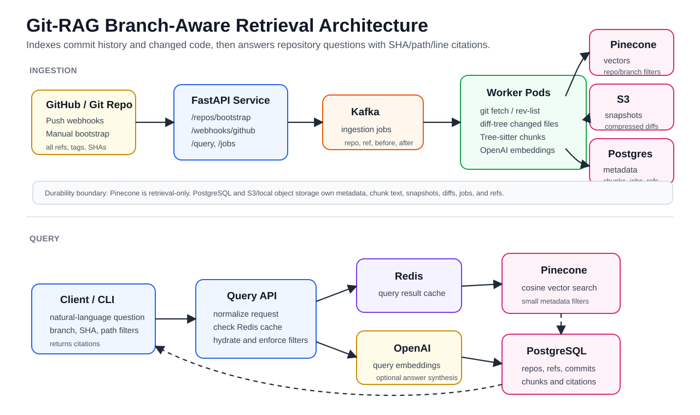

# Git-RAG

Git-RAG is a branch-aware retrieval system for software repositories. It mirror-clones Git repos, indexes code and diffs across commits and branches, stores durable metadata in SQL/object storage, and answers natural-language questions with commit/file/line citations.

The current implementation is a backend MVP: FastAPI, Git ingestion, Kafka worker flow, PostgreSQL metadata schema, S3/local differential snapshots, Redis query caching, Pinecone vector search, deterministic local test mode, Docker Compose, Kubernetes manifests, AWS/EKS Terraform, tests, and benchmark scripts.

## What It Does

- Indexes full Git history from mirror clones, not just the default branch.
- Parses changed files with Tree-sitter and chunks functions/classes plus diffs.
- Skips dependency/generated folders by default, including `node_modules`, `vendor`, `build`, and `dist`.
- Uses deterministic IDs for chunks, files, symbols, embeddings, and query cache keys.
- Caches embeddings by `content_hash + model` to avoid re-embedding identical content.
- Stores durable content/metadata in PostgreSQL plus S3 or local object storage.
- Keeps Pinecone metadata small and uses PostgreSQL for exact hydration.
- Supports branch/SHA/path-aware retrieval and returns citations with GitHub blob URLs when possible.
- Exposes ingestion, webhook, query, job, health, readiness, and metrics endpoints.

## Architecture



```text
GitHub push / manual bootstrap
        |
        v
FastAPI API
  - POST /repos/bootstrap
  - POST /webhooks/github
  - POST /query
        |
        v
Kafka ingestion topic
        |
        v
Worker pods
  - git fetch / rev-list / diff-tree
  - Tree-sitter chunking
  - OpenAI embeddings
        |
        +--> PostgreSQL metadata and chunk content
        +--> S3/local compressed snapshots and diffs
        +--> Pinecone vectors

Query path:
API -> Redis cache -> OpenAI query embedding -> Pinecone -> PostgreSQL hydration -> optional LLM answer
```

## Project Layout

```text
gitrag/                  Production backend package
  api/                   FastAPI app, schemas, webhook signature checks
  db/                    SQLAlchemy models and session helpers
  ingest/                Git bootstrap, chunking, storage, vector upsert orchestration
  queue/                 Kafka producer/consumer wrappers
  retrieval/             Embeddings, vector stores, Redis cache, query service
  storage/               S3/local object storage and snapshot policy
  workers/               Kafka ingestion worker entrypoint
alembic/                 Database migrations
docker/                  API and worker Dockerfiles, Prometheus config
k8s/                     Kubernetes manifests and HPA/KEDA examples
terraform/aws/eks/       AWS/EKS, RDS, MSK, ElastiCache, S3, ECR, Secrets Manager
tests/                   Unit, API, and integration tests
benchmarks/              1M-chunk seeding and query-load scripts
```

## Requirements

- Python 3.12+ recommended.
- Git.
- Optional for local multi-service runs: Docker Desktop or another Docker daemon.
- Optional for AWS deployment: Terraform, AWS credentials, and an EKS-capable AWS account.

For local no-cloud tests, you do not need OpenAI, Pinecone, Redis, Kafka, or AWS. Use deterministic embeddings and the in-memory vector backend.

For a real multi-process API + worker deployment, use a shared vector backend such as Pinecone. The in-memory vector backend is process-local, so it is only for tests and single-process smoke checks.

## Environment

Copy the example file and fill only what your target mode needs:

```bash
cp .env.example .env
```

Important variables:

```text
DATABASE_URL                    PostgreSQL URL, or sqlite:///./gitrag.db for local smoke tests
REDIS_URL                       Redis cache URL
KAFKA_BOOTSTRAP_SERVERS          Kafka/MSK bootstrap brokers
S3_BUCKET                       S3 bucket for snapshots/diffs
S3_ENDPOINT_URL                 Optional LocalStack/S3-compatible endpoint
PINECONE_API_KEY                Required for real Pinecone vector search
OPENAI_API_KEY                  Required for real embeddings and answer synthesis
GITHUB_WEBHOOK_SECRET           Required to verify GitHub push webhooks
GITHUB_ACCESS_TOKEN             Useful for private repos and GitHub API calls
GITRAG_VECTOR_BACKEND           pinecone or memory
GITRAG_DETERMINISTIC_EMBEDDINGS true for no-cloud local tests
INDEX_VENDOR_CODE               false by default; set true to index dependencies/vendor code
```

Never commit `.env`; it is ignored by git.

## Local Setup

Create or reuse the local virtual environment:

```bash
python3 -m venv gitrag.venv
gitrag.venv/bin/pip install -r requirements.txt
```

Run migrations against SQLite:

```bash
DATABASE_URL=sqlite:///./gitrag.db gitrag.venv/bin/alembic upgrade head
```

Run the API in local deterministic mode:

```bash
DATABASE_URL=sqlite:///./gitrag.db \
GITRAG_VECTOR_BACKEND=memory \
GITRAG_DETERMINISTIC_EMBEDDINGS=true \
CLONE_REPO_DIR=./repos \
LOCAL_OBJECT_DIR=./.gitrag-objects \
gitrag.venv/bin/python main.py api --reload
```

## CLI

Legacy script-compatible commands:

```bash
gitrag.venv/bin/python main.py clone
gitrag.venv/bin/python main.py ingest
gitrag.venv/bin/python main.py query "Where is auth handled?" --top-k 8
```

Production-oriented commands:

```bash
gitrag.venv/bin/python main.py bootstrap https://github.com/org/repo.git
gitrag.venv/bin/python main.py api --reload
gitrag.venv/bin/python main.py worker
gitrag.venv/bin/python main.py query "Where is routing defined?" --repo-id <repo_id> --no-llm
```

`bootstrap` persists repo/ref/commit metadata and enqueues an ingestion job when Kafka is configured. With `--no-enqueue`, it only creates the bootstrap job; it does not process the job by itself.

## API

Start the API, then call:

```bash
curl http://localhost:8000/healthz
curl http://localhost:8000/readyz
curl http://localhost:8000/metrics
```

Bootstrap a repo:

```bash
curl -X POST http://localhost:8000/repos/bootstrap \
  -H "Content-Type: application/json" \
  -d '{"repo_url":"https://github.com/org/repo.git","enqueue":true}'
```

Query an indexed repo:

```bash
curl -X POST http://localhost:8000/query \
  -H "Content-Type: application/json" \
  -d '{
    "repo_id": "repo-id-here",
    "question": "Where is routing defined?",
    "branch": "main",
    "top_k": 8,
    "include_answer": false
  }'
```

Other endpoints:

```text
POST /webhooks/github
GET  /jobs/{job_id}
GET  /repos/{repo_id}/branches
GET  /healthz
GET  /readyz
GET  /metrics
```

## Testing

Run everything:

```bash
gitrag.venv/bin/python -m pytest -q
```

Useful targeted checks:

```bash
gitrag.venv/bin/python -m pytest tests/unit -q
gitrag.venv/bin/python -m pytest tests/api -q
gitrag.venv/bin/python -m pytest tests/integration -q
gitrag.venv/bin/python -m compileall gitrag tests benchmarks
```

The integration tests create real Git repos, including repeated file changes and committed dependency folders, then verify ingestion and retrieval behavior.

## Docker Compose

Validate the Compose file:

```bash
docker compose -f compose.yml config
```

Run the local service stack:

```bash
docker compose -f compose.yml up --build
```

The Compose stack starts API, worker, PostgreSQL, Redis, Kafka, LocalStack S3, and Prometheus. For retrieval across separate API and worker containers, configure real `OPENAI_API_KEY` and `PINECONE_API_KEY` or another shared vector backend. The `memory` backend is not shared between containers.

## AWS/EKS Deployment

Terraform lives in `terraform/aws/eks/` and provisions:

- EKS cluster and managed node groups.
- ECR repositories for API and worker images.
- RDS PostgreSQL.
- ElastiCache Redis.
- MSK Kafka.
- S3 snapshot/diff bucket.
- Secrets Manager runtime secret.

Kubernetes manifests live in `k8s/` and include API/worker deployments, services, config, secret template, HPA, and optional KEDA Kafka-lag scaling.

Before deploying, you need:

- Terraform installed.
- AWS credentials with permissions for EKS, IAM, VPC, RDS, MSK, ElastiCache, S3, ECR, and Secrets Manager.
- `OPENAI_API_KEY`.
- `PINECONE_API_KEY`.
- GitHub webhook secret/token if using GitHub webhooks or private repos.

## Benchmarks

Seed synthetic chunks:

```bash
GITRAG_VECTOR_BACKEND=memory \
GITRAG_DETERMINISTIC_EMBEDDINGS=true \
gitrag.venv/bin/python benchmarks/seed_1m_chunks.py --repo-id bench --chunks 1000000
```

Run query load:

```bash
gitrag.venv/bin/python benchmarks/query_load.py \
  --url http://localhost:8000/query \
  --repo-id bench \
  --concurrency 50 \
  --requests 5000
```

The target for cached/filter-heavy retrieval is p95 under 100 ms. LLM answer synthesis is measured separately.

## Current Status

Verified locally:

- Test suite passes.
- Alembic migration creates a fresh SQLite database.
- Actual local repo ingestion works with deterministic embeddings and memory vectors.
- FastAPI smoke test works after indexing a repo in-process.
- Docker Compose config parses.
- Kubernetes YAML parses as YAML.

Not verified in this local environment:

- Live Docker containers, because the Docker daemon must be running.
- Terraform validation, because Terraform must be installed.
- Live Pinecone/OpenAI/AWS/EKS paths, because they require external credentials and may incur cost.
